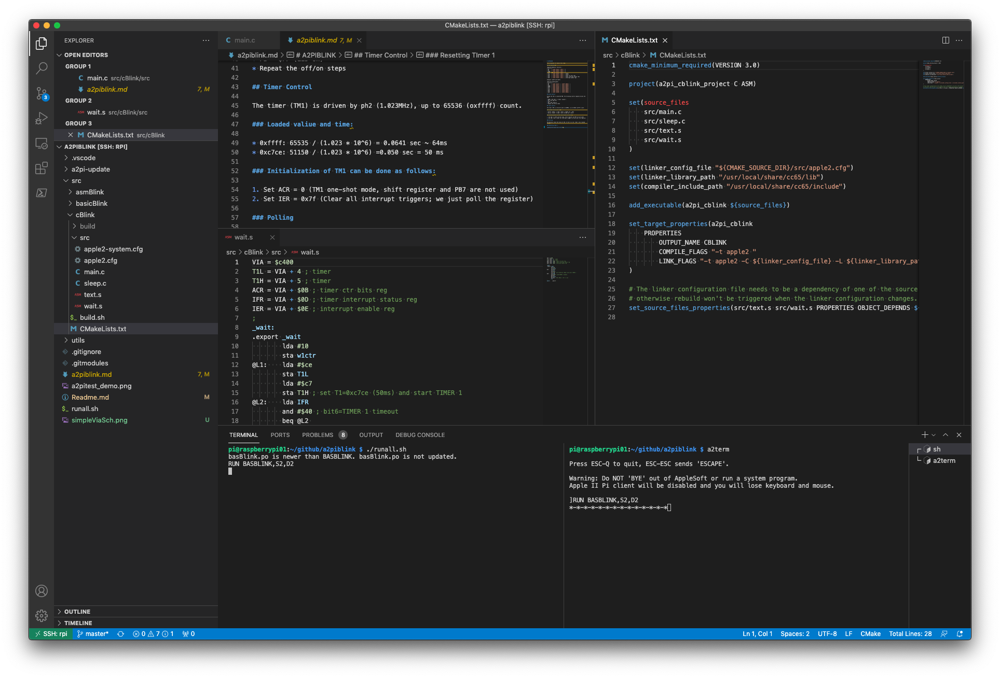

# A2PiBlink

 Blink programs for Apple IIe, using Apple II Pi + VSCode + CC65.



Clone this repo, `a2piblink`, on a Raspberry Pi (3A+ or 3B+ recommended) connected to an [Apple II Pi](https://github.com/dschmenk/apple2pi) card. By setting up [VSCode Remote Development](https://code.visualstudio.com/docs/remote/remote-overview) on the Raspbery Pi, you can develop Apple II software in Basic, C and Assembly language, from your modern OS PC (Win/Mac/Linux) desktop. C and Assembler programs are built with [cc65-toolchain-example](https://github.com/fo-fo/cc65-toolchain-example.git).

The sample programs in this repo blink an LED on a simple VIA card. It is assumed that the card is set in Slot 4 of the Apple IIe.

## Prerequisites

Install the following on the Raspberry Pi which is connected to the Apple II Pi card:

* [Apple II Pi card & software](https://github.com/dschmenk/apple2pi)
* [CC65](https://github.com/cc65/cc65)
* [AppleCommander](https://github.com/AppleCommander/AppleCommander)
* [VSCode](https://code.visualstudio.com/download) [Remote Development](https://code.visualstudio.com/docs/remote/remote-overview)
* A simple VIA 6522 card, details are described in the [next section](#Simple_VIA_Card)

Note: after cloning this repository, run the following command to download the submodule:

```git submodule update -i```

(```git clone``` does not do this automatically)

## Simple VIA Card

This software uses a 6522VIA for controlling a blinking LED. [See this document](./viaCard.md).

## Quick Run

Open a terminal session on the Raspberry Pi and run:

```
git clone https://github.com/ryu10/a2piblink.git
cd a2piblink
./runall.sh
./runall.sh cleanall
```

Also you can open a separate ```a2term``` session on the Raspberry Pi.

## Source Directories

* `src/basicBlink` : Blink program in Applesoft Basic
* `src/cBlink` : Blink program in  C (CC65)
* `src/asmBlink` : Blink program in 6502 Assembly language (CA65)
