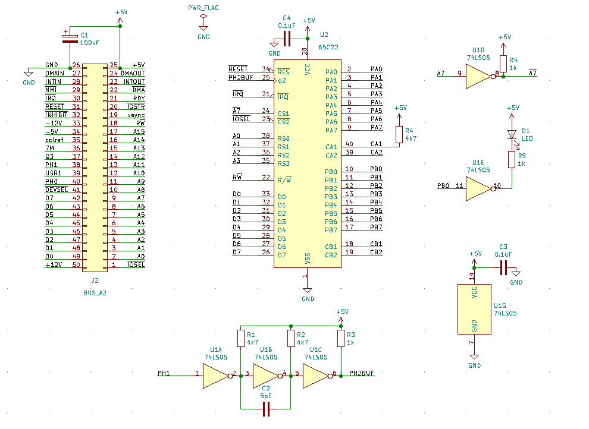

# A2PiBlink

 Blink programs for Apple IIe, using Apple II Pi + VSCode + CC65.


This repo, `a2piblink`, should be placed on a Raspberry Pi (3A/B+ recommended) connected to an [Apple II Pi](https://github.com/dschmenk/apple2pi) card. By setting up [VSCode Remote Development](https://code.visualstudio.com/docs/remote/remote-overview) on the Raspbery Pi, you can develop Apple II programs in Basic, C or Assembly language, from your modern OS PC (Win/Mac/Linux). C and Assembler prograsm are built with [cc65-toolchain-example](https://github.com/fo-fo/cc65-toolchain-example.git).

The sample programs in this repo blink an LED on a simple VIA card. It is assumed that the card is set in Slot 4 of the Apple IIe.

## Prerequisites

Install the following on the Raspberry Pi which is connected to the Apple II Pi card:

* [Apple II Pi card & software](https://github.com/dschmenk/apple2pi)
* [CC65](https://github.com/cc65/cc65)
* [AppleCommander](https://github.com/AppleCommander/AppleCommander)
* [VSCode](https://code.visualstudio.com/download) [Remote Development](https://code.visualstudio.com/docs/remote/remote-overview)
* A simple VIA 6522 card, details are described in the [next section](#Simple_VIA_Card)

## Simple VIA Card

A simple VIA (6522) card can be made using the schematic below. Port B register is assigned to the lowest address in the card. PB0 is connected to the input of an OC Not gate (74ls05) and the output of the not gate is connected to a LED and a resistor.



By controlling Bit 0 of PB, you can blink the LED.

The important VIA addresses are listed in the tables below.

|Register|Address| Function |
|--|--|--|
| PB    | `$Cx00 (49152 + 256*x)` ||
| PA    | `$Cx01 (49153 + 256*x)` ||
| DDRB  | `$Cx02 (49154 + 256*x)` ||
| DDRA  |	`$Cx03 (49155 + 256*x)` ||
| T1L   | `$Cx04 (49156 + 256*x)` | timer|
| T1H   | `$Cx05 (49157 + 256*x)` | timer|
| ACR   | `$Cx0B (49163 + 256*x)` | timer ctr bits reg|
| IFR   | `$Cx0D (49165 + 256*x)` | timer interrupt status reg|
| IER   | `$Cx0E (49166 + 256*x)` | interrupt enable reg|

Examples (SLOT4 and SLOT7)

|Register|SLOT4|SLOT7|
|--|--|--|
| PB    | `$C400 (50176)` | `$C700 (50944)` |
| PA    | `$C401 (50177)` | `$C701 (50945)` |
| DDRB  | `$C402 (50178)` | `$C702 (50946)` |
| DDRA  | `$C403 (50179)` | `$C703 (50947)` |
| T1L   | `$C404 (50180)` | `$C704 (50948)` |
| T1H   | `$C405 (50181)` | `$C705 (50949)` |
| ACR   | `$C40B (50187)` | `$C70B (50955)` |
| IFR   | `$C40D (50189)` | `$C70D (50957)` |
| IER   | `$C40E (50190)` | `$C70E (50958)` |

## Quick Run

```
git clone https://github.com/ryu10/a2piblink.git
cd a2piblink
./runall.sh
./runall.sh cleanall
```

## Source Directories

* `src/basicBlink` : Blink program in Applesoft Basic
* `src/cBlink` : Blink program in  C (CC65)
* `src/asmBlink` : Blink program in 6502 Assembly language (CA65)
