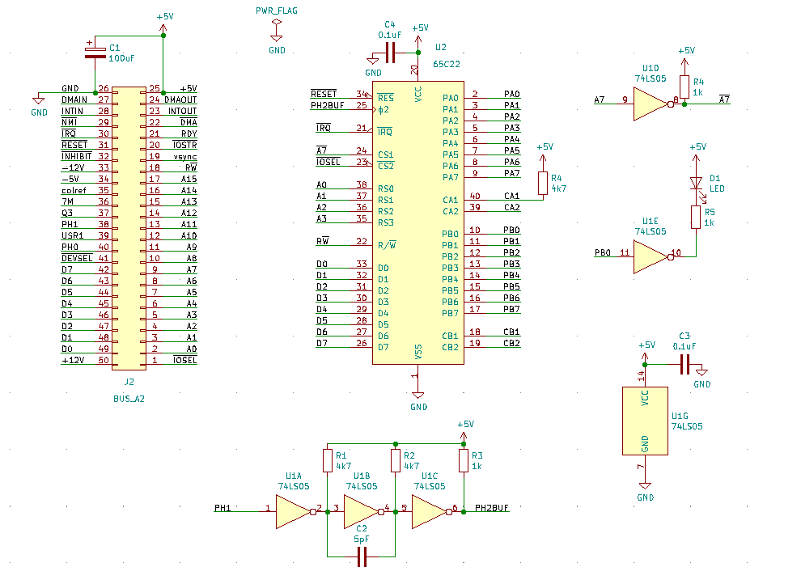

# Simple VIA Card

A simple VIA (6522) card for the Apple II. It can be built using the schematic shown below.

Port B register is assigned to the lowest address in the card. PB0 controls an OC Not gate (74ls05) whose output is connected to an LED and a resistor in series.

## Schematics

## VIA Ports and Registers

By controlling bit 0 of PB, you can blink the LED. The VIA addresses are listed in the tables below.

|Register|Address| Function |
|--|--|--|
| PB    | `$Cx00 (49152 + 256*x)` | port B |
| PA    | `$Cx01 (49153 + 256*x)` | port A |
| DDRB  | `$Cx02 (49154 + 256*x)` | PB data direction |
| DDRA  |	`$Cx03 (49155 + 256*x)` | PA data direction |
| T1L   | `$Cx04 (49156 + 256*x)` | timer counter |
| T1H   | `$Cx05 (49157 + 256*x)` | timer counter |
| ACR   | `$Cx0B (49163 + 256*x)` | aux control |
| IFR   | `$Cx0D (49165 + 256*x)` | interrupt flag |
| IER   | `$Cx0E (49166 + 256*x)` | interrupt  enable |

Examples (SLOT4 and SLOT7)

|Register|SLOT4|SLOT7|
|--|--|--|
| PB    | `$C400 (50176)` | `$C700 (50944)` |
| PA    | `$C401 (50177)` | `$C701 (50945)` |
| DDRB  | `$C402 (50178)` | `$C702 (50946)` |
| DDRA  | `$C403 (50179)` | `$C703 (50947)` |
| T1L   | `$C404 (50180)` | `$C704 (50948)` |
| T1H   | `$C405 (50181)` | `$C705 (50949)` |
| ACR   | `$C40B (50187)` | `$C70B (50955)` |
| IFR   | `$C40D (50189)` | `$C70D (50957)` |
| IER   | `$C40E (50190)` | `$C70E (50958)` |

## Control Sequence

1. DDRB := 0xff ; Port B output
2. ACR  := 0    ; Timer1=OneShot, ShiftReg=Disabled, PB7=Unaffected
3. IER  := 0x7f ; All IRQ sources disabled
4. PB   := 1; LED on
5. (wait for 500ms)
6. PB   := 0; LED off
7. (wait for 500ms)
8. Repeat Steps 4 through 7 for 16 times; 16 blinks in approx. 16 seconds.

### wait for 500ms

1. T1L := 0xce ; init T1 with 0xc7ce ; ~50ms with Apple II Ph2 (1.024MHz)
2. T1H := 0xc7 ; Once T1H is writtern, one-shot Timer 1 starts
3. Wait until bit 6 of IFR is set (Timer1 Timeout)
4. Repeat Steps 1 through 3 for 10 times (50ms x 10 = 500ms)
